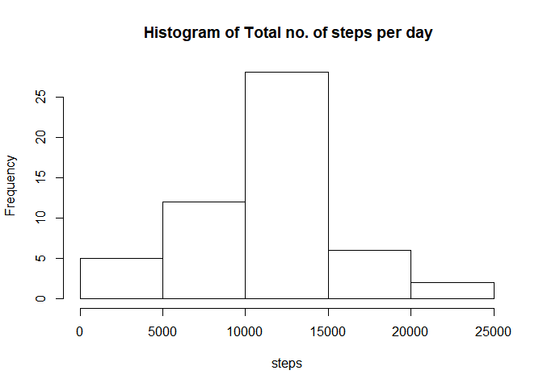
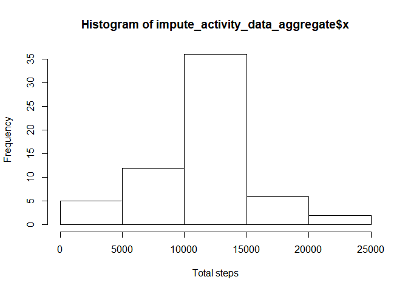
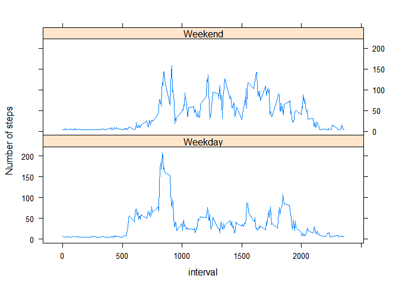

## Loading and preprocessing the data

```r
if("plyr" %in% rownames(installed.packages()) == FALSE) {install.packages("plyr")}
if("Hmisc" %in% rownames(installed.packages()) == FALSE) {install.packages("Hmisc")}

library("plyr")
library("Hmisc")
```

```
## Loading required package: lattice
```

```
## Loading required package: survival
```

```
## Loading required package: Formula
```

```
## Loading required package: ggplot2
```

```
## 
## Attaching package: 'Hmisc'
```

```
## The following objects are masked from 'package:plyr':
## 
##     is.discrete, summarize
```

```
## The following objects are masked from 'package:base':
## 
##     format.pval, units
```

```r
#Read data into a file and remove NAs
activity_DS <- read.csv("activity.csv")
DS_WONA <- activity_DS[complete.cases(activity_DS),]
DS_WONA$date <- as.Date(DS_WONA$date)
#any(is.na(DS_WONA))
```
## What is mean total number of steps taken per day?


```r
tot_steps_day <- aggregate(DS_WONA$steps, by=list(date=DS_WONA$date), FUN=sum)
names(tot_steps_day) <- c("date", "steps")
hist(tot_steps_day$steps, main = " Histogram of Total no. of steps per day", 
     xlab = "steps")
```

<!-- -->

```r
#Find the mean and median
mean(tot_steps_day$steps)
```

```
## [1] 10766.19
```

```r
median(tot_steps_day$steps)
```

```
## [1] 10765
```

##What is the average daily activity pattern?


```r
#find average steps taken per interval across all days
avg_steps_interval <-aggregate(DS_WONA$steps, by=list(DS_WONA$interval), FUN=mean, na.rm=TRUE)
names(avg_steps_interval) <- c("interval", "steps")

plot(steps ~ interval, avg_steps_interval,type='l')
```

<!-- -->

```r
avg_steps_interval[which(avg_steps_interval$steps==max(avg_steps_interval$steps)),1]
```

```
## [1] 835
```

##Imputing missing values


```r
#Number of missing values before impute
nrow(activity_DS[(is.na(activity_DS$steps)),])
```

```
## [1] 2304
```

```r
#impute missing values with mean
impute_activity_data <- activity_DS
impute_activity_data$steps <- impute(activity_DS$steps,mean)

#Number of missing values AFTER imputing with mean
nrow(impute_activity_data[(is.na(impute_activity_data$steps)),])
```

```
## [1] 0
```

```r
impute_activity_data_aggregate <- aggregate(impute_activity_data$steps, by=list(impute_activity_data$date), FUN=sum, na.rm=TRUE)

hist(impute_activity_data_aggregate$x,xlab="Total steps")
```

<!-- -->

##Are there differences in activity patterns between weekdays and weekends?


```r
impute_activity_data$wday <- as.factor(ifelse(weekdays(as.POSIXct(impute_activity_data$date)) %in% c("Saturday","Sunday"), "Weekend", "Weekday"))

avg_wday_steps<-aggregate(impute_activity_data$steps, by=list(Date=impute_activity_data$interval,impute_activity_data$wday),FUN=mean)
avg_wday_steps$x<-as.numeric(avg_wday_steps$x)


xyplot(x~Date|Group.2, data=avg_wday_steps,layout=c(1,2),type="l", xlab="interval",ylab="Number of steps")
```

<!-- -->
